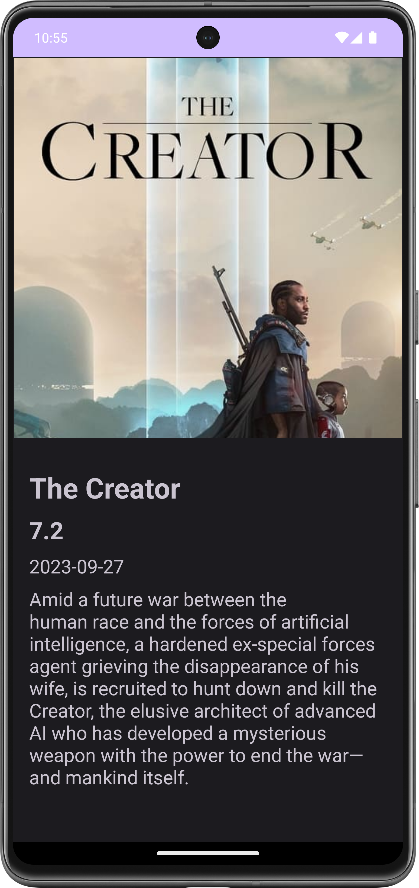

# MVVM Android App with Coroutines and Retrofit

This is a simple Android app that demonstrates the Model-View-ViewModel (MVVM) architectural pattern while using Coroutines and Retrofit to fetch and display data from the MovieDB API.

## Features

- Fetches and displays a list of movies from the MovieDB API.
- Implements MVVM architecture for clean and maintainable code.
- Utilizes Coroutines for asynchronous operations.
- Uses Retrofit for making network requests.
-  Movie Details page with Room Database
## Screenshots

| Home Screen | Details Screen |
| ------- | ------- | 
|||

## Libraries Used
- Coroutines for managing asynchronous tasks.
- Retrofit for making API requests.
- Glide for loading and caching images.
- ViewModel from Android Architecture Components.
- LiveData for reactive data updates.
- Room for save data in a local database

## Installation
Clone the repository:

Copy code
```bash
 git clone https://github.com/kochipek/mvvm-MovieApp.git

```
Open the project in Android Studio.

add your MovieDB API key

Build and run the app on an Android emulator or a physical device.

## Usage
The app displays a list of popular movies on the home screen.
Click on a movie to view more details. //Todo
